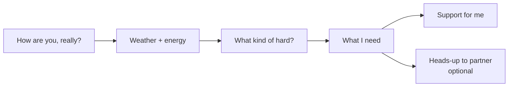

# Tend Spec (Hub Module)

2026-09-18 · Jen. Revised the same day to match `spec-update-1.md`: the Support app is named **Tend**, with module id `tend` and route `/tend`. Any older text saying "the Support app" means Tend.

## Purpose

Tend is the Hub module for hard moments. It supports whoever is struggling right now and shows the other partner practical, specific ways to love them well. It serves two goals at once: "help me" and "help me help you."

This module follows the **Hub Contract** (`/docs/hub-contract.md`) in every respect: login, profiles and the user manual, privacy, heads-ups, gentle day mode, shame-free rules, design, and the shared AI coach with its safety guardrails. This spec covers only what is specific to Tend. When anything here seems to conflict with the contract, the contract wins, and Claude Code should flag the conflict.

**Design principles specific to this module:**

- Meet the person where they are. Every tool has a 2-minute version.
- Never argue with the person's thoughts. Get them out of the head and onto the screen, then help choose one next step.
- Support what actually helps, not just what feels good in the moment. For example, the app avoids endless reassurance.
- Tools are tailored by each person's user manual rather than hard-coded to either person. Each person turns on the tools they want, and the sections below show the starting set for each of them.

## The check-in

The check-in is the front door of the module. Tapping "How are you, really?" anywhere in The Shire opens it. It takes under 60 seconds, uses taps rather than typing, and every step can be skipped.

The flow runs left to right, and the heads-up step is always optional.

**Step 1: Weather and energy.** Five visual weather icons (sunny, partly cloudy, foggy, stormy, heavy) show how the person feels. A separate energy slider runs from "running on empty" to "revved up," because low mood and high energy can happen together, and the app needs to see that.

**Step 2: What kind of hard?** The person picks one or more tiles: overwhelmed, stuck in a loop, can't start, feeling rejected, old pain showing up, low or heavy, too wired, shut down, shame spiral, sensory overload, or "I don't know." Each person can rename, hide, or add tiles.

**Step 3: What I need.** Options are space, quiet presence, practical help, words, prayer, or "please don't fix it."

**Then** the app opens the matching tools (Support for me) and asks whether to send a heads-up. It never sends one automatically.

Every check-in is saved privately to the person's log. A quick "Just logging, I'm fine" option lets someone record a good day in one tap.

> **Build note (phase 1 is in place).** The shell already has a three-choice check-in at `/check-in` (steady, tender, low) that writes `checkIns` rows and emits `checkin.*` events. Tend's richer flow replaces that screen and keeps writing the same rows and events, so nothing else in The Shire changes. "Prayer" is a new "what I need" option: add it to `helpKind` in `convex/schema.ts` and to the shell's heads-up copy when Tend is built.

## Support for me: tools for both of us

These tools are available to both people. The check-in answers decide which ones appear first, and they can also be opened from the module's tool library at any time.

| Tool | For when | What it does |
| --- | --- | --- |
| Ground Me | Overwhelmed, wired, or sensory overload | Guided breathing with a visual pace, a 5-4-3-2-1 senses exercise, or a sensory reset checklist (dim lights, headphones, weighted blanket, water) |
| Shame Interrupter | Shame spiral or harsh self-talk | Names the shame voice, then asks "What would I say to my partner if they did this?" and writes a kinder true sentence to keep |
| Good Enough | Perfectionism or stuck on quality | Asks what "good enough to be done" looks like for this task, then saves it as the finish line |
| Smallest Step | Can't start | Shrinks any task into a 2-minute first action and offers a timer |
| Talk It Out | Anything | A private chat with the AI coach, grounded in the person's user manual |
| Anchor | Low, heavy, or afraid | Shows the person's saved faith anchors (scriptures, prayers, songs), if enabled |
| Shutdown Recovery | Shut down or overloaded | Ultra-low-demand screen: a few yes/no taps for water, food, rest, quiet, and "tell John/Jen" |

Every tool ends with the same gentle close: "Did that help a little, not really, or not at all?" The answer is saved privately, so over time the app learns which tools help each person and offers those first.

## John's toolkit

John's starting tools target thinking projects through to completion, focus and procrastination, logic loops that keep him stuck, and low self-esteem. Jen can turn any of these on for herself too.

### Loop Breaker

Loop Breaker is for when careful logic has become a trap. It never debates the logic. It gets the loop out of his head and sorted.

1. **Dump.** He types every "but what about…" as a separate card, as fast as he wants. There's no limit.
2. **Sort.** He drags each card into one of three columns: *Solve now*, *Solve later* (parked with a date), or *Can't be solved by thinking harder*.
3. **Pick one.** From *Solve now*, he picks the single card he'd be willing to test, then writes the smallest action that tests it.
4. **Decide by default.** For decisions, he names the reasonable default and sets a timer (15 minutes to 2 days). If the choice is still open when the timer ends, the default wins, and the app records it as a decision made, not a failure.

The AI coach can help sort the cards, but it must not argue with them or pile on counterpoints.

### Project Thinker

Project Thinker walks a project from idea to finish, one question per screen:

1. What does "done" look like? (Uses the Good Enough finish line.)
2. What are the big parts?
3. What does each part need first? (Dependencies.)
4. What could block it, and what's the plan if it does?
5. What's the very first physical action, and when?

The result is saved as a visual checklist with parts as cards and steps inside. He can send it to Every Box or share it with Jen for body-doubling. The AI coach can suggest missing details at each step, but it only suggests, and he decides.

### Focus Mode

Focus Mode shows one task, one timer (default 25 minutes, adjustable), and nothing else on screen. It includes an optional "Jen is body-doubling" toggle, which shows her as present and lets her join from her own device. When the timer ends, the app asks "Keep going, break, or switch?" with no pressure either way.

### Evidence Bank

The Evidence Bank is a shared, running record of real things he did well, logged by him or by Jen, with the date and what it showed about him (for example, "followed through," "patient," "figured it out"). When the Shame Interrupter runs or a check-in shows a shame spiral, the app offers three random entries. Entries should name specific things, not general praise.

## Jen's toolkit

Jen's starting tools target rejection sensitivity, old trauma showing up in the present, cycle-linked mood shifts, energy and mood swings, obsessive loops, and low moments, especially around relationships. John can turn any of these on for himself too.

### Story Check

Story Check is for the sting of feeling rejected or left out. One question per screen:

1. What actually happened? (Just the facts a camera would record.)
2. What story am I telling about it?
3. What are two or three other explanations that also fit the facts?
4. What could I ask directly? The app helps draft a short, non-accusing question, such as "Hey, when you went quiet earlier, was that about me or just a long day?"

She can then save it privately or send the question to John as a gentle heads-up.

### Then or Now

Then or Now is for when old pain shows up in the present. It helps separate past danger from present safety: what am I feeling, how old does this feeling seem, what is actually true right now, and what do I need right now? It ends with a grounding step and an option to ask John for quiet presence.

### Cycle forecast

Jen logs cycle start dates, and the app learns which days tend to be hardest. A few days before a harder stretch, both partners see a soft heads-up ("Tender week starts Tuesday") as a shared summary. John sees the forecast, never the underlying data. That week, the app offers lighter defaults, and the fitness module can plan gentler sessions through the `forecast.tenderWeek` hook.

### Mood and sleep log

The check-in data, plus optional sleep hours, builds a private chart over time. The app watches for patterns worth noticing, such as less sleep with rising energy for several days in a row, or several low days in a row. When it spots one, it gently says so, suggests a slowing tool, and suggests bringing the pattern to her doctor. It never diagnoses. A one-tap export produces a clean summary she can bring to appointments.

### Pause Before Big Moves

This is optional, and Jen sets it up in advance on a steady day. When her energy reads "revved up" for a while, the app gently reminds her of her own rule, such as waiting 24 hours before big purchases, commitments, or major decisions, in her own words.

### Sit With It (loop-aware support)

When a worry keeps asking for the same reassurance, answering again usually feeds the loop. So the app, and the AI coach, notices repeated reassurance-seeking and gently names it. It then offers Sit With It instead: name the urge, rate it, set a short timer, and watch the urge rise and fall without answering it. John's partner guidance includes the same idea, with loving scripts for not supplying reassurance on repeat.

### Low moments

For heavy days, the app offers the smallest possible care steps (water, food, shower, sunlight, a text to someone), Anchor, and a one-tap heads-up asking John for the kind of love she named in her manual.

## Love them well: partner guidance

When a heads-up arrives, the receiver gets clear, specific guidance for loving this person, right now, in this kind of hard. The guidance draws on three sources: the sender's check-in, the sender's user manual, and the starter guidance below. Each person can edit their own entries.

Every guidance card uses the same layout: **Do** (practical actions), **Say** (one or two sample lines), **Skip** (what not to do right now), and **Pray** (optional, when both have enabled faith features).

**Starter guidance for supporting John:**

| When he's… | Do | Say | Skip |
| --- | --- | --- | --- |
| Stuck in a logic loop | Sit with him and open Loop Breaker together | "I'm not going to argue the whole thing. What's one piece you'd be willing to test?" | Debating each point or counter-arguing |
| Can't start | Offer to body-double, or do the first 2 minutes side by side | "Want company for the first step?" | Reminding him how long it's been |
| Overwhelmed by a project | Open Project Thinker with him | "Let's just find what done looks like." | Adding new ideas to the pile |
| Low on self-worth | Add a specific entry to his Evidence Bank and tell him | "I noticed you ___. That mattered." | General praise he can argue with |

**Starter guidance for supporting Jen:**

| When she's… | Do | Say | Skip |
| --- | --- | --- | --- |
| Feeling rejected | Answer her Story Check question directly and warmly | "I'm not upset with you. I'm here." | Going quiet or answering vaguely |
| In old pain | Offer quiet presence and a calm voice | "You're safe with me right now." | Reasoning her out of the feeling |
| In a tender week | Take one task off her plate without being asked | "I've got dinner tonight." | Big conversations or surprises |
| Asking for the same reassurance again | Answer once, lovingly, then point to Sit With It | "I love you, and I trust you can sit with this." | Repeating the reassurance on loop |
| Revved up | Stay calm and help slow things down | "Can we sleep on that one together?" | Matching the energy or shaming it |
| Low or heavy | Offer the love she named in her manual | "No need to talk. I'm just here." | Pep talks or fixing |

**Love Menus.** Each person keeps a menu of small ways they like to be loved, in three columns: practical, emotional, and spiritual (for example, "refill my water," "sit on the porch with me," "pray over me"). The receiver can pick one straight from the heads-up card. Doing it emits `loveAction.done`.

## Shared ground: repair, patterns, appreciation

Shared ground is the part of the module the two of them use together.

**Repair.** A guided conversation for after a conflict or a hurt. Either person can start it, and the other can accept now or pick a later time. The flow works like this:

1. Each person privately writes what happened for them, what they felt, and what they needed.
2. Both reveal at the same time, so neither has to go first.
3. Each reflects back what they heard: "What I heard you say is…"
4. Each names one thing they own and one thing they'd like next time.
5. They close together with a repair gesture from the other person's Love Menu.

The AI coach can help either person put their feelings into words privately. It never judges who was right.

**Patterns, together.** A monthly "How are we doing?" view shows only what both have chosen to share: tools that helped each person most, love actions done, and upcoming tender weeks. It shows no scores and no comparisons between the two of them.

**Appreciation.** A quick "I saw you" note either person can send anytime, for everyday gratitude as well as hard days. Notes about John can be saved straight to his Evidence Bank, and Jen can keep her own Evidence Bank the same way.

## Hub integration

Tend plugs into the Hub through its manifest, with no custom wiring in the shell. The manifest already exists at `modules/tend/manifest.tsx` with a placeholder screen.

| Manifest field | Tend setting |
| --- | --- |
| `id`, `route` | `tend`, `/tend` (the old `/support` redirects here) |
| `theme` | A warm hearth corner inside the village palette: sage green, warm wood, and candlelight gold (`spec-update-1.md`) |
| `todayWidget` | Shows only when there's an open heads-up, a tender-week forecast, or a pending repair invite |
| `gentleModeBehavior` | Opens straight to the three tools that have helped this person most, in low-demand layout |
| `headsUpTypes` | Check-in heads-up, Story Check question, repair invite, urgent help |
| `sharedData` | Heads-ups, love menus, Evidence Bank, repair conversations, shared summaries, appreciation notes |
| `usesAICoach` | Yes |

**Events it emits:** `checkin.low` (when the weather is foggy, stormy, or heavy), `checkin.revved`, `forecast.tenderWeek`, `loveAction.done`, and `repair.completed`.

**Events it listens for:** `category.stuck` from Every Box, which offers John or Jen a Project Thinker session for that category.

> **Conflict flagged, contract wins.** The original spec said the check-in button belongs to this module and hides if the module is turned off. The Hub Contract says the "How are you, really?" button is visible on every screen in every module, and phase 1 built it into the shell. So the button stays even when Tend is off: it then opens the shell's own three-choice check-in. When Tend is on, its richer check-in takes over the same button.

## Screens and navigation

The module has five main areas, reached from a simple sub-navigation inside the Tend tab.

| Area | Screens |
| --- | --- |
| Now | Check-in flow, suggested tools, send heads-up, "Need help now" link |
| My tools | Tool library, each tool's screen, my log and chart, my Evidence Bank, my safety plan |
| For you | Partner's open heads-ups, guidance cards, partner's Love Menu, send an "I saw you" note |
| Together | Repair, monthly "How are we doing?", shared forecast |
| My manual | Edit my user manual sections, my Love Menu, my check-in tiles, and which tools are on |

On phones, "Now" is the default screen. On a gentle day, the module skips the sub-navigation entirely and opens to the three most helpful tools.

Make the Loop Breaker sort board, the Project Thinker checklist, and the mood chart visual first, using cards, color, and simple charts, since Jen learns visually. Keep text short on every screen.

## Build order and acceptance checks

Build in four steps, each usable on its own, after the Hub foundation (Hub Contract phase 1) is in place.

| Step | Build | Done when |
| --- | --- | --- |
| 1 | Check-in, heads-up cards, guidance cards, Love Menus | Jen checks in and sends a heads-up, and John sees Do/Say/Skip and responds, in under 2 minutes total |
| 2 | Shared tools, Loop Breaker, Story Check, Evidence Bank | Each tool works end to end, has a 2-minute version, and saves privately |
| 3 | Project Thinker, Focus Mode, Then or Now, Sit With It, Pause Before Big Moves | Project Thinker produces a saved checklist that can be sent to Every Box |
| 4 | Cycle forecast, mood and sleep log, pattern notices, Repair, monthly view | John sees the forecast summary but cannot see any underlying tracking data |

**Checks that apply to every step:**

- [ ] Private data is blocked at the data layer. Test by trying to read the partner's private rows from the other account.
- [ ] Nothing in the module shows a streak, score, missed-day count, or red overdue badge.
- [ ] Every screen has a low-demand version and works during gentle mode.
- [ ] Crisis wording in any text field or coach chat triggers the Hub's crisis flow, and "Need help now" is reachable from every screen.
- [ ] The AI coach declines to take sides, does not diagnose, and names repeated reassurance loops gently.
- [ ] All copy is plain and literal, with no guilt language.

## Open decisions

- [x] Module name: **Tend** (`spec-update-1.md`).
- [x] Final color palette for this module: sage green, warm wood, candlelight gold, inside the village tokens (`spec-update-1.md`).
- [x] The Hub's own name: **The Shire** (`spec-update-1.md`).
- [ ] Whether John wants to review and edit the starter guidance for supporting him before build step 1. (Pending; John will review when he has time.)
- [x] Faith features (Anchor, the Pray line) are on by default for both. Decided 2026-09-18. Either person can still turn them off in their own settings.
